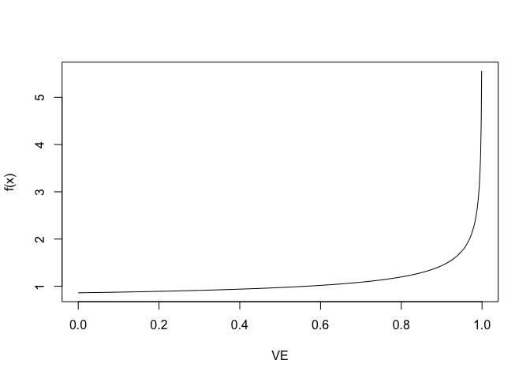
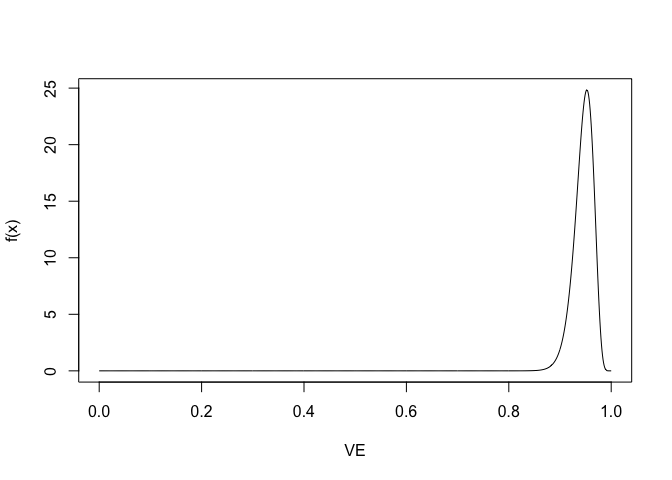

My take on the Pfizer results
================

Inspired by others and realizing this a good chance to learn a bit about
Bayesian statistics, here’s my take on the Pfizer calculations.

``` r
a <- 0.700102
b <- 1

theta <- function(ve) {
  (1 - ve) / (2 - ve)
}

ve <- function(theta) {
  (1 - 2*theta) / (1 - theta)
}

mu_beta <- function(x, a, b) {
  x * prior(x, a, b)
}

prior <- function(x, a = 0, b = 0) {
  dbeta(x, 0.700102 + a, 1 + b)
}

ci <- function(x, a, b) {
  qbeta(x, 0.700102 + a, 1 + b)
}

criterion <- function(a, b) {
  pbeta(theta(0.3), 0.700102 + a, 1 + b, lower.tail = FALSE)
}

calc_statistics <- function(a = 0, b = 0) {
  theta <- integrate(mu_beta, 0, 1, a = a, b = b)$value
  ci <- rev(ve(ci(c(0.005, 0.995), a, b)))

  cat(sprintf("E[theta]: %.4f\n", theta))
  cat(sprintf("VE: %.4f\n", ve(theta)))
  cat(sprintf("P(VE < 30%%): %g\n", criterion(a, b)))
  cat(sprintf("VE 99%% Credible Interval: %.4f, %.4f", ci[1], ci[2]))

  theta_dist <- function(x) {
    dbeta(theta(x), 0.700102 + a, 1 + b)
  }
  
  curve(theta_dist, n = 1000, xlab = "VE", ylab = "f(x)")
}
```

The prior:

``` r
calc_statistics()
```

    ## E[theta]: 0.4118
    ## VE: 0.2999
    ## P(VE < 30%): 0.462702
    ## VE 99% Credible Interval: -138.1707, 0.9995

<!-- -->

Assuming an 8 and 86 case split between the arms:

``` r
n <- 170
n_vac <- 8
n_placebo <- n - n_vac
calc_statistics(n_vac, n_placebo)
```

    ## E[theta]: 0.0507
    ## VE: 0.9466
    ## P(VE < 30%): 1.96001e-28
    ## VE 99% Credible Interval: 0.8851, 0.9821

<!-- -->
